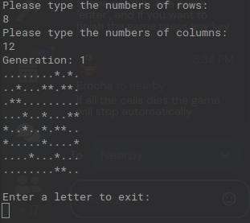
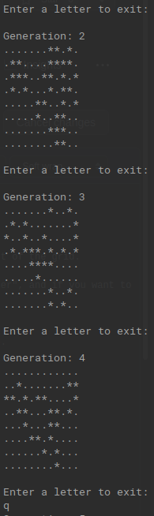

# Setup
## Normal users process
1. To run this code you will need a version of Ruby  more recent than 3.
2. To run the game you need to execute game.rb, like: ruby App/game.rb.
3. When the game is running, you need to type the row and column numbers to set the width and height of the grid.

4. After this you will see the first generation of cells, if you want to see another one press "enter", and if you want to finish the game press any key.

- If all the cells dies the game will stop automatically

## Developer process
- If you want to test the methods of the program then you will need to install some gems that you cand find in the file 'Gemfile' just run the command 'bundle install' and the gem will automatically be installed
- Also you will need to add the rubycritics and rspec gem to "Gemfile"

### TDD
- spec/game_spec.rb does a Test to verify that the creation of a new generation is correct.
- spec/neighbors_spec.rb tests to verify that a cell's neighbor count is correct.
- spec/grid_spec.rb tests to verify that a grid can't have width and height equal to 0.

### Team Members
- nallely64 <nallelygar.64@gmail.com> 
- brocha05 <brocha_05@hotmail.com>
- Frcomparan <frcomparan@gmail.com>
- AlejandroCuriel <alex_curielg@hotmail.com>